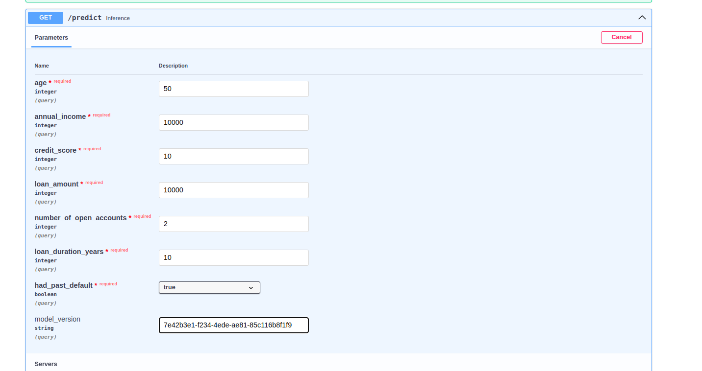
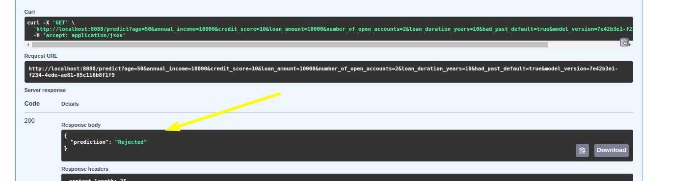
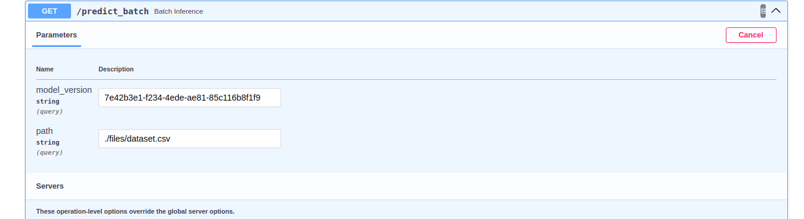
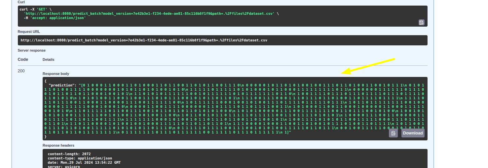
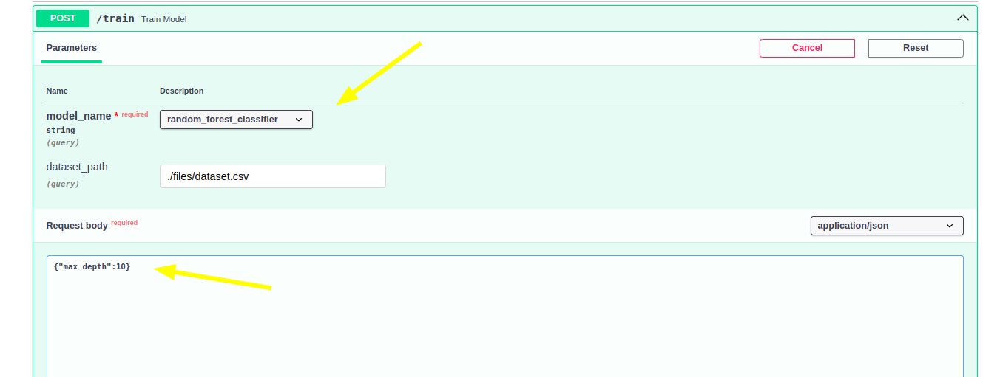
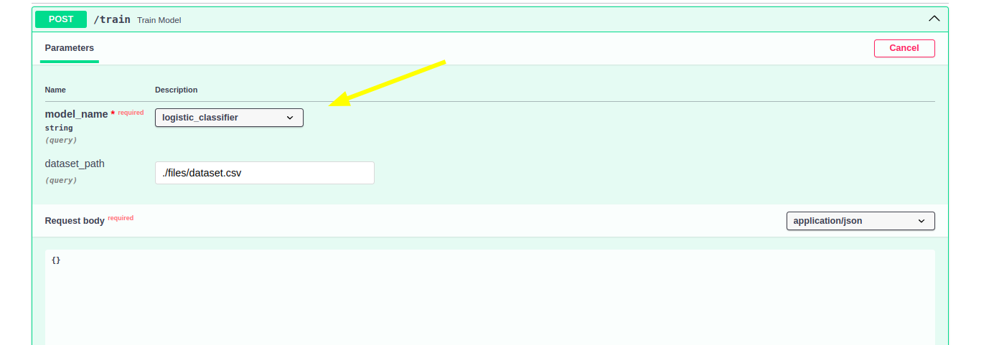
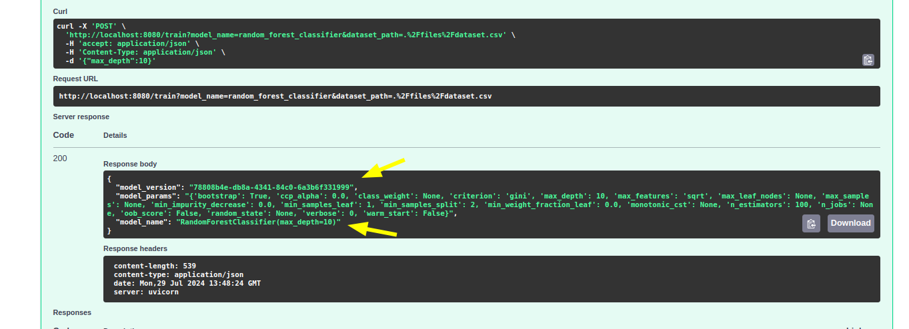
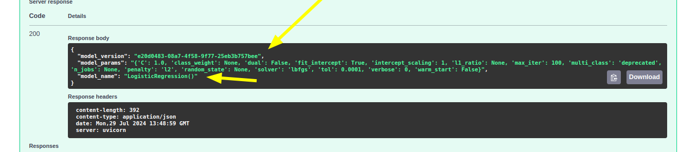

# Machine Learning Engineering Assignment

This assignment is expected to be completed by a Machine Learning Engineer within 3-4 hours.

### Assignment:

Your teammate Mike gave you a Machine Learning Model that needs to be deployed, examine the model.py file. 
Your task is to add the necessary components to get this model to production, 
this model is crucial for the company's success, so it should be available receive and predict data upon request.
This model should work for any cloud provider. Also this is the model v1 of a series of versions to be deployed.
(Optional): you can come up with a better model pipeline if you think the one provided is not suitable for this case.

Add all the necessary files, code, docs, to improve this repository and make this model ready to be shipped.

Note: You can reach out to us through email at marcos.soto@qubika.com or anibal.jasin@qubika.com but since
you could be working off hours we suggest you can write down questions and assumptions you came across
and what decision you take e.g. “I’m gonna assume this project should have X because of Y” or 
“I would ask about if there is some ACL for this model, so I would assume X”.

Some general considerations and guidance:

- It is expected that you include files, code, documentation, and any other resources you find useful in the new repository you create.
- A fully production-ready model deployed in the cloud is not required.
- You are not expected to spend money on cloud services, ensuring everything works locally is sufficient.
- It is acceptable if some aspects are not fully functional, our goal is to understand your approach to this problem.
- In case you don’t finish the assignment, you can add what other things you would do in the README.md.


---------------------------------------------------------------------------
version=0.0.3


# Solution

# Machine Learning Engineer Test Documentation

This documentation provides an overview of the task for developing a machine learning API using FastAPI, with endpoints for inference on single data points and batch data, as well as a training endpoint. The test also includes implementing a local model versioning system. Below, you'll find detailed instructions and guidelines for each component.

## Project Structure

```
qubika_test/
│
├── files/
│   ├── model_version/       # versioning tool folder
       ├──  version_id/
         ├── artifacts/
         ├── metrics/
         ├── model.pkl
│   ├── dataset.csv        # data for training and inference testing
 loan model/
│   ├── base     # base code shared by the pipelines
│   ├── inference      # Inference pipeline results
│   └── training         # Training pipelines

├── requirements.txt     # List of dependencies
├── README.md            # Project README file
└── Dockerfile           # Dockerfile for containerization
└── main.py           # Fast api main file
└── test.py           # Test file file

```

## FastAPI Endpoints

### 1. **Single Data Point Inference Endpoint**

**Endpoint**: `/predict`

**Method**: `GET`

**Description**: Takes a single data point as input and returns the model's prediction.

**Input**
Model features and model version

**Response**:
- JSON object containing the prediction

Response:
```json
{
  "prediction": "Approved",
}
```


### 2. **Batch Inference Endpoint**

**Endpoint**: `/predict_batch`

**Method**: `GET`

**Description**: Takes a batch of data points and returns predictions for each.

**Input**:
- Path where the data of the features is located and model version

**Response**:
- JSON object containing an array of predictions and the model version used.

**Example**:

Response:
```json
{
  "predictions": [0, 1, ...],
}
```


### 3. **Training Endpoint**

**Endpoint**: `/train`

**Method**: `POST`

**Description**: Initiates a training process using the provided data and model that you want to use. Right now the logistic regression model and random forest classifier are supported by the system. The new model version is saved locally with a uuid format.

**Request Body**:
- Optional JSON object specifying training parameters such as number of max_depth, learning rate, etc. If not provided, defaults are used.

**Response**:
- JSON object containing a message about the status of the training process and the new model version.

**Example**:

```json
POST /train
model_name
{
  "max_depth": 10
}
```



Response:
```json
{
  "model_version": "7e42b3e1-f234-4ede-ae81-85c116b8f1f9",

  "model_parameters": """{'bootstrap': True, 'ccp_alpha': 0.0, 'class_weight': None, 'criterion': 'gini', 'max_depth': 10, 'max_features': 'sqrt', 'max_leaf_nodes': None, 'max_samples': None, 'min_impurity_decrease': 0.0, 'min_samples_leaf': 1""",

  "model_name":"RandomForestClassifier(max_depth=10)"
}
```


## Model Versioning

### Loading Models
- Models are stored in the `files/model_versions/model_version_id` directory where inside each model version id stores
a `model.pkl` file a folder called `artifacts` where the all the additional files will be stored, for example: Imputers, transformers or any addtional information and the `metrics` folder where the metrics are stored as .csv file.


### Saving Models
- After training, the new model is saved with an random version number and with all the versioning files inside the folder.

## Dependencies

- All required dependencies are listed in the `requirements.txt` file. To install them, use:

```bash
pip install -r requirements.txt
```


## Docker

A `Dockerfile` is provided for containerizing the application. To build the Docker image, use:

```bash
docker compose up 
```
## Makefile

## Makefile Usage Instructions

The `Makefile` provided in the project is designed to streamline common tasks such as setting up the environment, running the application, and managing the Docker container. Below are the instructions for using the `Makefile`.

### Common Commands

1. **Build Docker Image**
   - **Command**: `make build`
   - **Description**: Builds the Docker image for the application
   - **Usage**:
     ```bash
     make build
     ```
2. **Run Application Locally**
   - **Command**: `make run`
   - **Description**: Starts the FastAPI server locally using `uvicorn`. The server will reload automatically on code changes.
   - **Usage**:
     ```bash
     make run
     ```

3. **Run Tests**
   - **Command**: `make test`
   - **Description**: Runs unit tests using `pytest` to ensure that the application behaves as expected.
   - **Usage**:
     ```bash
     make test
     ```
6. **Clean Up**
   - **Command**: `make clean`
   - **Description**: Cleans up any temporary files or build artifacts, including Docker images and containers.
   - **Usage**:
     ```bash
     make clean
     ```

This `Makefile` provides a simple interface for managing your development tasks. By using these commands, you can streamline your workflow and ensure consistency across different environments.

